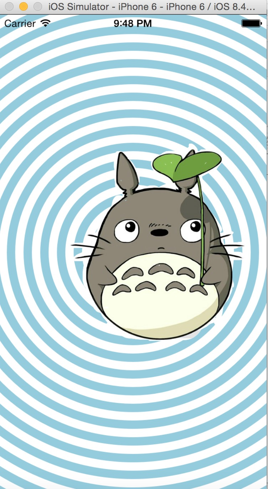
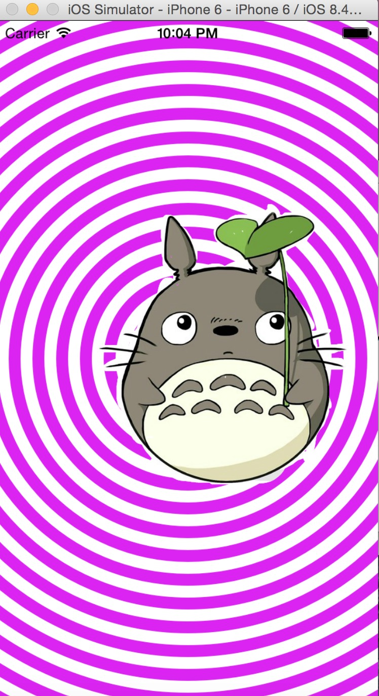
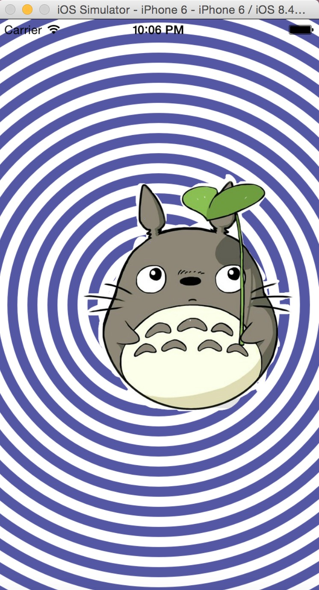
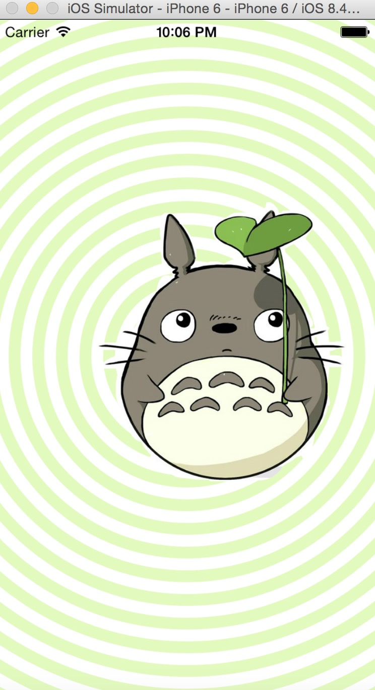

##A demo for practice (ios programming)
+ ######The functions of this demo contains:
  * Draw concentric circle in the screen.
  * Put a image above the concentric circle.
  * Redraw the concentric circle: when users touched the screen,the color of the concentric circle changed.
   
  _Note:redraw the view using the code:_
  `[self setNeedsDisplay];`
  
+ ######The demo display in the monitor:

 

